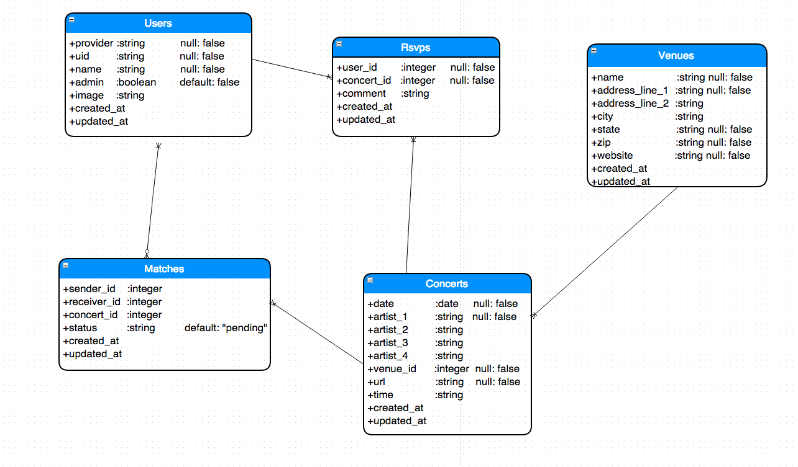
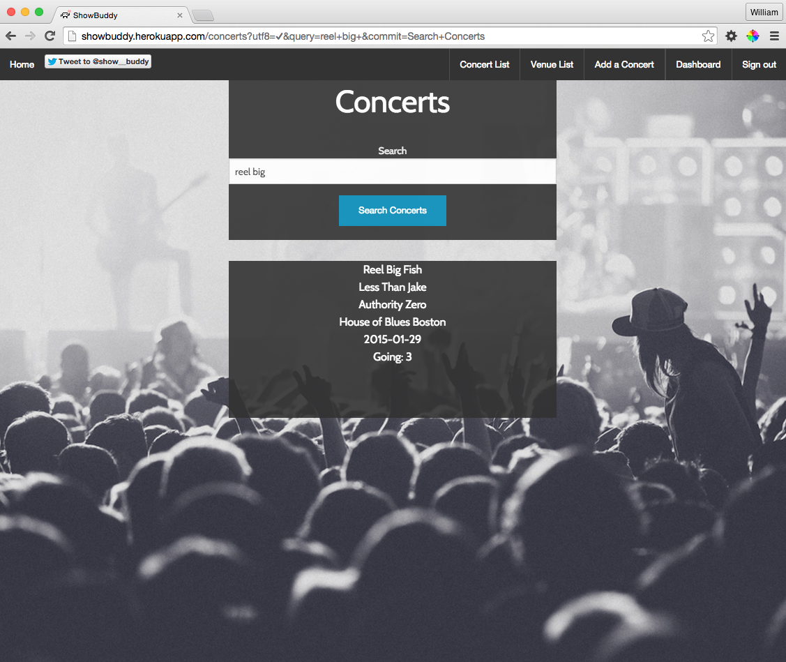
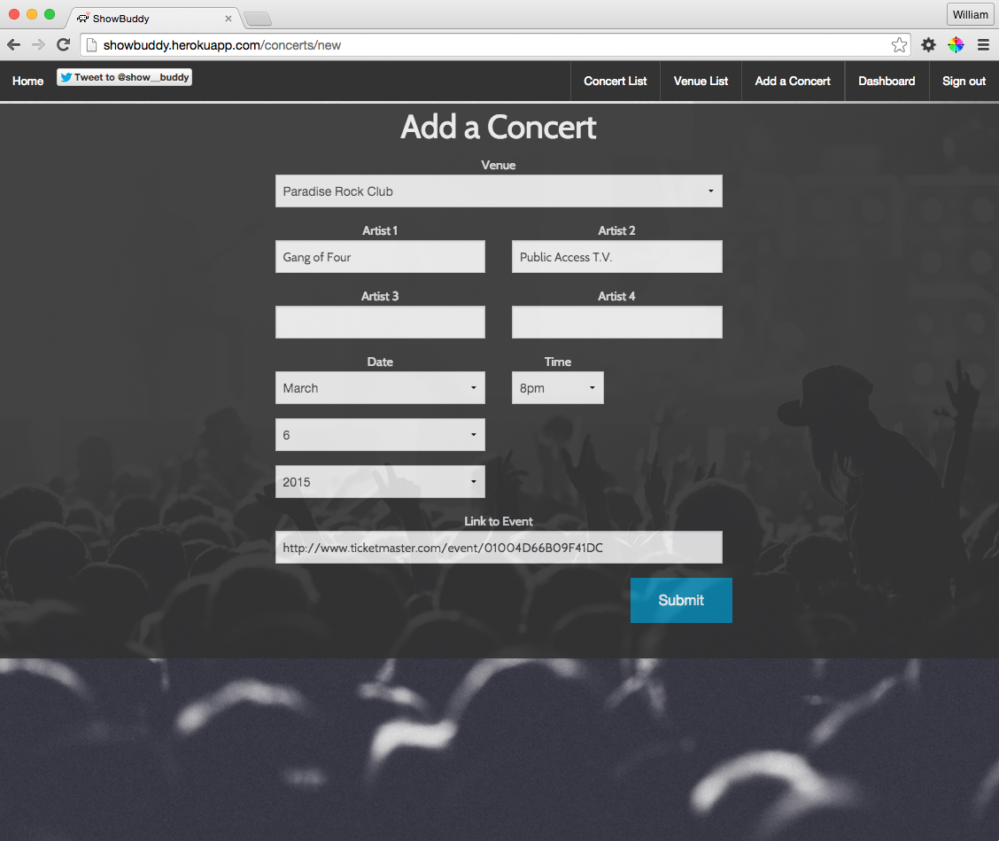
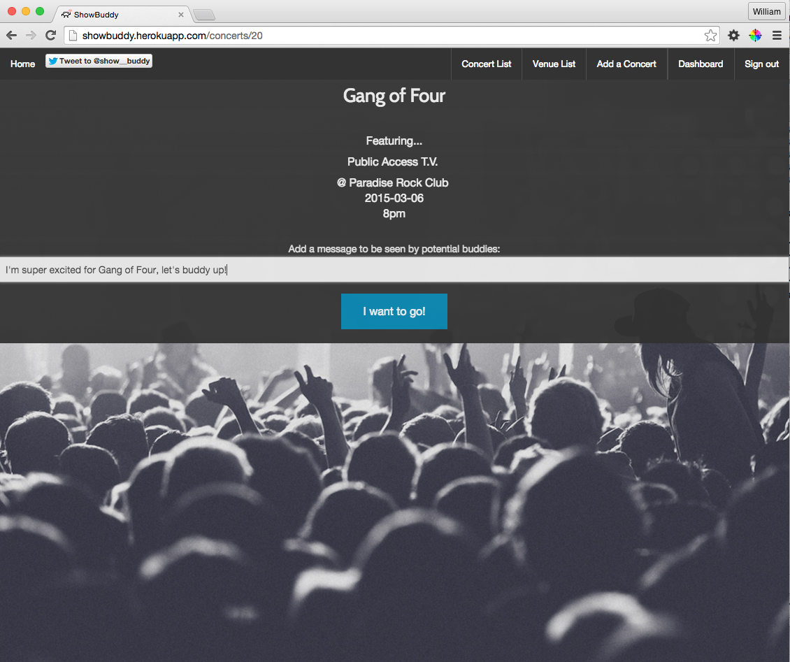
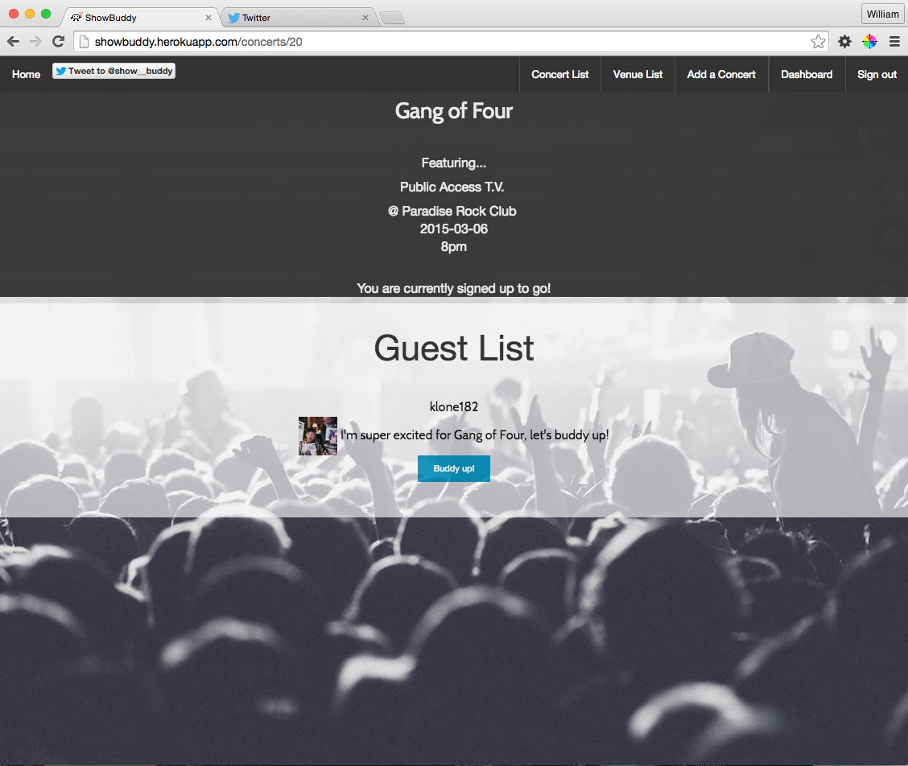
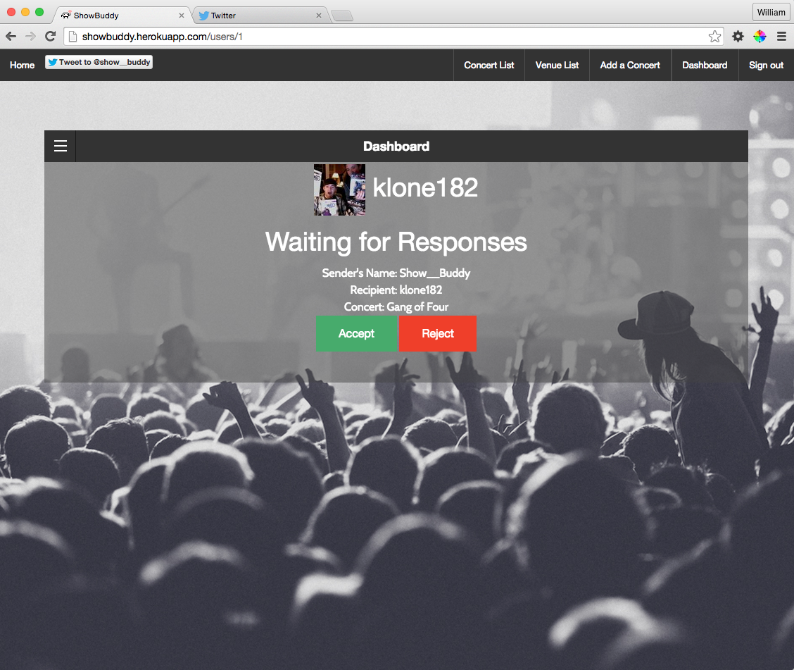
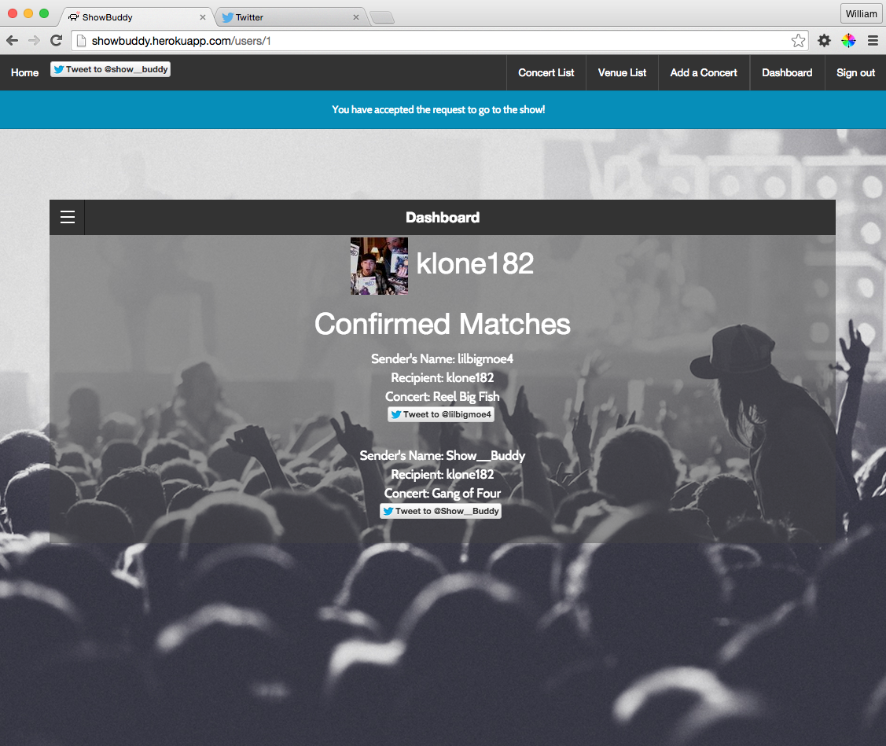

# ShowBuddy

[](https://travis-ci.org/billyacademy/showbuddy) [](https://codeclimate.com/github/billyacademy/showbuddy) [](https://coveralls.io/r/billyacademy/showbuddy)


ShowBuddy is a meet-up application geared towards music fans. <br>
It leverages the omniauth-twitter gem to authenticate users.

ShowBuddy is currently accessible at http://showbuddy.herokuapp.com/

## Current Features
```
1. Users are able post upcoming concerts at local venues
2. Users are able to RSVP to individual concerts
3. A user is able send a request to buddy up with other users who are rsvp'd to the same concert
4. A user who receives a request to buddy up can choose to accept or reject the request
5. When two users have mutual interest in attending a show together a twitter button will appear on each user's confirmed matches section of their dashboard to help begin the conversation & planning
6. Admins are able to Add, Update or Delete venues. Admins can delete user accounts
7. A user can utilize search functionality to find concerts of the bands they want to see
```

## Features in Process
```
1. Biggest priority is building a match percentage for users
  - Create a list of bands / artists
  - Create a section for users to rate bands (Love, Like, Dislike, Don't Know)
  - Weight those ratings
```
Imagine two users are rating a band, if user A loves the band and user b also loves the band then they will get 200 points out of a possible 200.<br>
Whereas if user A likes a band and user B dislikes a band, their match will get 0 out of a possible 50 points.<br>

Now when comparing two users for a match percent we can take their aggregate score across all bands that they have rated in common.<br>
In the case above, user A and user B have two bands in common, scoring 200 out of 250.  Their match percentage would be 80%.

Below is a table that encapsulates a rough draft of the ratings. <br>

| | Love | Like | Dislike | Dont Know
|------|----------|------|----------|----------
|**Love** | `200 / 200` | `100/100` | `0/200`| `0/25`
|**Like** |  `100/100`| `100/100`| `0/50`| `0/10`
|**Dislike** | `0/200`| `0/50`| `100/100`| `0/0`
|**Dont Know** | `0/25`| `0/10`| `0/0`| `25/25`


## Timeline:

January 2nd
Began outlining User Stories and the ER Diagram for ShowBuddy.  Eventually settled on this ER diagram




January 3rd <br>
- Created the rails application and began integrating RSpec / Capybara / FactoryGirl to begin to write feature tests.

January 4th <br>
- Wrote tests for concerts, began seeding venues into the database, updated routes, added a welcome page (with slogan!)

January 8th <br>
- Began styling for the first time, getting a better feel for CSS and Foundations.  Added a Background & NavBar

January 9th <br>
- More Testing, tried out a jquery-ui gem (eventually wound up scrapping as the benefit did not outweigh the cost of the addition)

January 11th <br>
- Added error messages for form validations, more work styling (venues, navbar), more testing

January 12th <br>
- Began building out the RSVP table <br>
- Added User table & model <br>
- Added Twitter Authentication with the omniauth-twitter gem <br>
- Did some twitter omniauth troubleshooting <br>
- Updated ENV file so that sensitive twitter information was not pushed to github

January 13th <br>
- RSVPs are working as intended, a victory <br>
- Added some uniqueness restraints to RSVPs so that a user can't RSVP multiple times to a show <br>
- Ran some tests on creating an RSVP

January 14th <br>
- Created a Sign In helper to allow feature testing as a user signed in via twitter omniauth <br>
- Concerts show page is coming together, shows a guest list once you have RSVP'd <br>
- Added a User show page, very basic.  A more involved User page is a goal down the line.

January 15th <br>
- Admin Namespacing <br>
- Admin functionality, admins will hold most of the power to delete and update. <br>
- Added an admin boolean to user table <br>
- Began incorporating Travis CI for continuous integration

January 16th <br>
- More work with Admin <br>
- Begin to seed concert data <br>
- Added next/upcoming show to venues show page <br>
- Model validations <br>
- Added destroy dependencies on venues and users

January 17th <br>
- Pagination to Venues and Concert indexes - Using Kaminari Gem <br>
- Styling <br>
- Added Search functionality to concerts index <br>

January 18th <br>
- Pulling Twitter image for user avatars <br>
- Added profile pictures to different areas of site for styling <br>
- Added the ability to comment with an RSVP, a status of sort that gives you rsvp more personality

January 19th <br>
- Added the matches table <br>
- Added Match model <br>
- Matches has two users and will need to be made have self referential associations for ActiveRecord <br>
- Fixed routes.rb <br>
- Started creating a dashboard for statistics on matches and requests <br>
- Add accept and reject buttons for when someone requests you as a show buddy

January 20th <br>
- Styling
- Refactoring code

January 21st <br>
- Adding Helpers to clean up code <br>
- Updated Gemfile, rails12factor was in the wrong spot, lead to some undesirable logs with rspec <br>
- Added associations to User model <br>
- Updated the render call in the venues controller <br>
- Javascript & CSS for the dashboard, this is a rewarding challenge

January 22nd <br>
- HTML validating, needed to work through some HTML errors to fix a testing issue. Had somehow nested a form inside of a form. Fixed. <br>
- Styling of welcome page <br>
- Added Model testing <br>
- Including partials to clean up code in views <br>
- Removed price from the concert table, I don't see the "value" (nailed it.) in keeping price as a column

January 23rd <br>
- Finally added self referential assocation for users ont he match table.  Big help with ActiveRecord <br>
- Deleted some unused code in venues controller <br>
- More Styling <br>
- Updated Tests <br>

January 24th <br>
- Added favicon (it's the little things) <br>
- Fixed some logic to prevent "Featuring..." from appearing when there was only one band assigned to a concert <br>
- Began working on README for project description and workflow <br>
- Updated Matches table with timestamps and null false on columns <br>


## Screen Shots
Welcome Page:


Users have the ability to search for a concert:


Users have the ability to submit concerts:


Users also have the ability to RSVP to concerts:


Users can optionally buddy up with fellow concert goers:


The user who receives the request to buddy up is able to accept or reject the invite:


Once the match is confirmed by the recipient of the invite, each user is given
the option to tweet their new buddy and begin planning!

