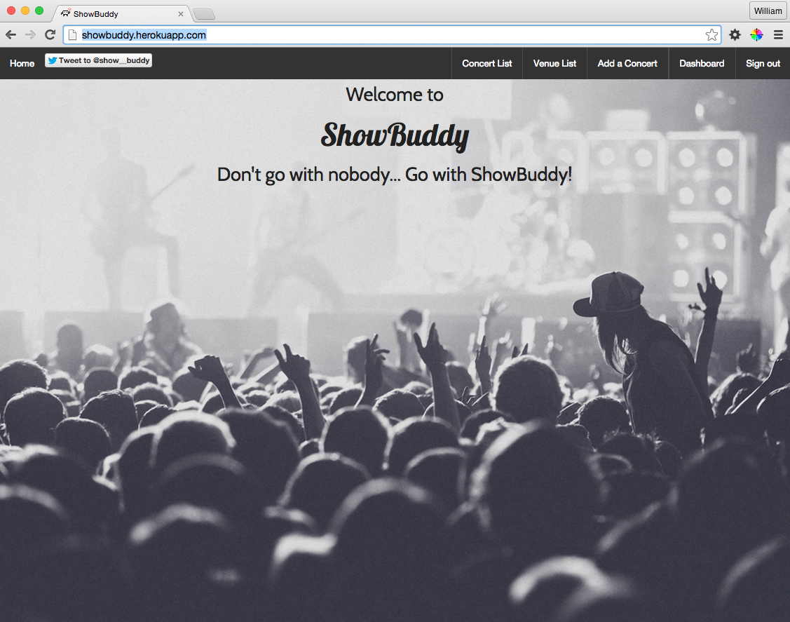

  

ShowBuddy is a meet-up application geared towards music fans.
It leverages the omniauth-twitter gem to authenticate users.

ShowBuddy is currently accessible at http://showbuddy.herokuapp.com/

Timeline:

January 2nd
Began outlining User Stories and the ER Diagram for ShowBuddy.  Eventually settled on this ER diagram

January 3rd  

Created the rails application and began integrating RSpec / Capybara / FactoryGirl to begin to write feature tests.

January 4th  
Wrote tests for concerts, began seeding venues into the database, updated routes, added a welcome page (with slogan!)

January 8th
Began styling for the first time, getting a better feel for CSS and Foundations.  Added a Background & NavBar

January 9th
More Testing, tried out a jquery-ui gem (eventually wound up scrapping as the benefit did not outweigh the cost of the addition)

January 11th
Added error messages for form validations, more work styling (venues, navbar), more testing

January 12th
Began building out the RSVP table
Added User table & model
Added Twitter Authentication with the omniauth-twitter gem
Did some twitter omniauth troubleshooting
Updated ENV file so that sensitive twitter information was not pushed to github

January 13th
RSVPs are working as intended, a victory
Added some uniqueness restraints to RSVPs so that a user can't RSVP multiple times to a show
Ran some tests on creating an RSVP

January 14th
Created a Sign In helper to allow feature testing as a user signed in via twitter omniauth
Concerts show page is coming together, shows a guest list once you have RSVP'd
Added a User show page, very basic.  A more involved User page is a goal down the line.

January 15th
Admin Namespacing
Admin functionality, admins will hold most of the power to delete and update.
Added an admin boolean to user table
Began incorporating Travis CI for continuous integration

January 16h
More work with Admin
Begin to seed concert data
Added next/upcoming show to venues show page
Model validations
Added destroy dependencies on venues and users

January 17th
Pagination to Venues and Concert indexes - Using Kaminari Gem
Styling
Added Search functionality to concerts index

January 18th
Pulling Twitter image for user avatars
Added profile pictures to different areas of site for styling
Added the ability to comment with an RSVP, a status of sort that gives you rsvp more personality

January 19th
Added the matches table
Added Match model
Matches has two users and will need to be made have self referential associations for ActiveRecord
Fixed routes.rb
Started creating a dashboard for statistics on matches and requests
Add accept and reject buttons for when someone requests you as a show buddy

January 20th
Styling
Refactoring code

January 21st
Adding Helpers to clean up code
Updated Gemfile, rails12factor was in the wrong spot, lead to some undesirable logs with rspec
Added associations to User model
Updated the render call in the venues controller
Javascript & CSS for the dashboard, this is a rewarding challenge

January 22nd
Forms are now having blanks nilified with nilify blanks gem
HTML validating, needed to work through some HTML errors to fix a testing issue.  Had somehow nested a form inside of a form. Fixed.
Styling of welcome page
Added Model testing
Including partials to clean up code in views
Removed price from the concert table, I don't see the "value" (nailed it.) in keeping price as a column

January 23rd
Finally added self referential assocation for users ont he match table.  Big help with ActiveRecord
Deleted some unused code in venues controller
More Styling
Updated Tests

January 24th
Added favicon (it's the little things)
Fixed some logic to prevent "Featuring..." from appearing when there was only one band assigned to a concert
Began working on README for project description and workflow
Updated Matches table with timestamps and null false on columns

Below are some screens of the application..
Welcome Page:

Users have the ability to search for a concert:

Users have the ability to submit concerts:

Users also have the ability to RSVP to concerts:

Users can optionally buddy up with fellow concert goers:

The user who receives the request to buddy up is able to accept or reject the invite:

Once the match is confirmed by the recipient of the invite, each user is given
the option to tweet their new buddy and begin planning!

